Title: Image Aesthetic Assessment
Date: 2017-04-01 00:00
Category: Deep Learning
Summary: Image Aesthetic Assessment using Deep Learning. The defined network takes the complete image instead of fixed or re-sized input. This makes the network to learn about original image composition. 
Tags: image quality prediction using deep learning, spatial pyramid pooling, spp-net, image quality asssessment
Title_image: ./../images/image_aesthetics_code.jpg 
Gitrepo: https://github.com/yardstick17/ConnectingDots

**_"Beauty is really in the eye of the beholder"_**

Image aesthetics assessment is an attempt to define the **beauty** of an Image.
While everyone has different tastes, there are universally accepted norms when it comes to beauty – things which everyone pretty much agrees are beautiful, like sunsets or sunrises over the mountains or the ocean.

Some of the visual features which are generally taken into consideration for an appealing or an unattractive photograph. Some of them are:
 

* **Edge distributions, Low depth of field,** Images where the subject is in sharp focus while the background is blurred are generally considered aesthetically pleasing. 
* **Color histogram, Opposing colors,** Displaying colors that appear on opposite sides of the color wheel is visually pleasing.
* Some photographic rules like **Rule of thirds** also determines the beauty of an image. It states that dividing an image into nine equal parts by drawing two vertical and two horizontal lines should reveal the primary compositional elements near the intersections of the lines.
* **Salient objects,** Images depicting a large salient object, well separated from the background often have the best composition.

 

Defining image quality with visual features like other manually curated features are limited in the scope.

The two photographer's story.

  Great Shot!!  | So what?
  ------------- | -------------
  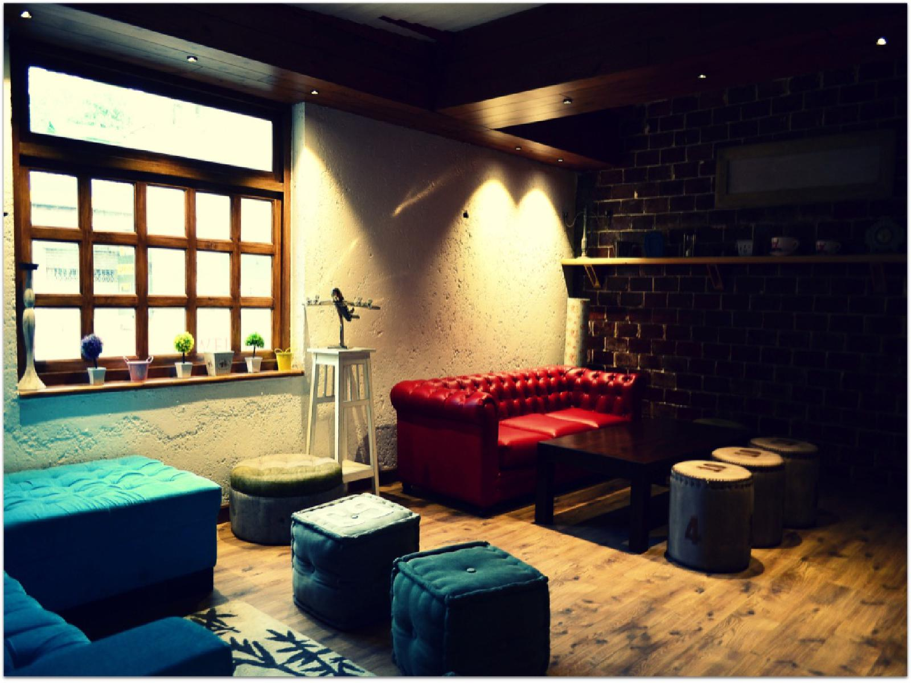  | 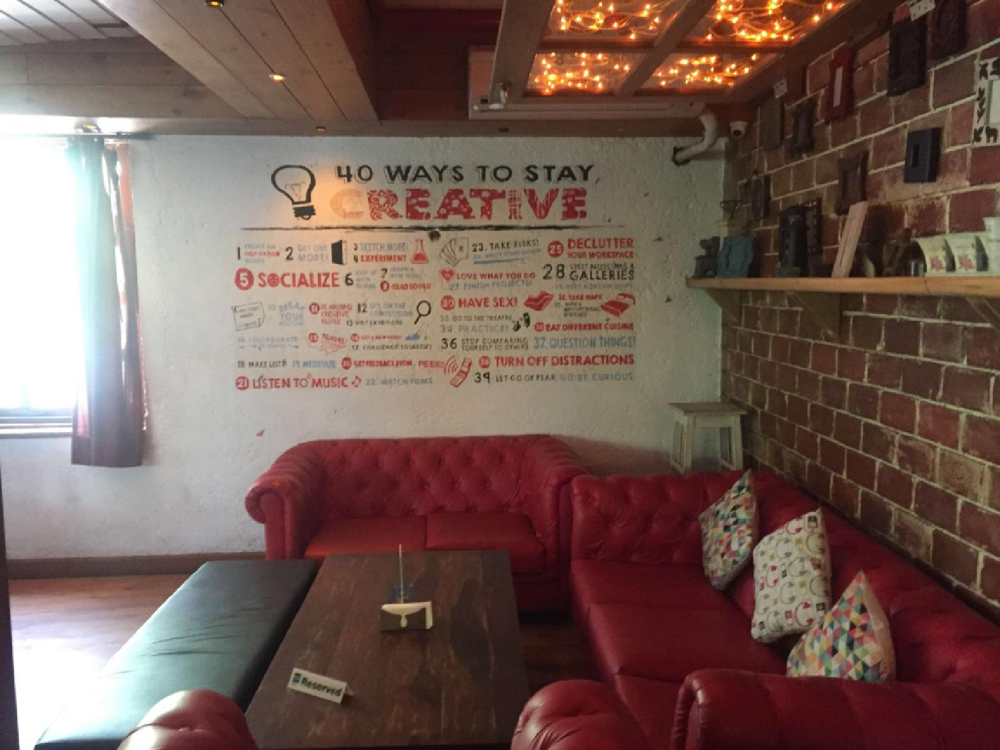
  
The Image is of the same place taken with different lightning, angle, adjusted contrast. And it is obvious that image on the left has better aesthetic attire.

**Significance of Image Aesthetics**

For a platform especially that serves media content, one of the crucial aspects is to show high-quality content. With social sites and the given ‘selfie’ trend, we are generating a huge amount of data in the form of either images or videos.
 Having a track on the quality will always be helpful.

  Curated Content  |  User Generated Content
  ------------- | -------------
  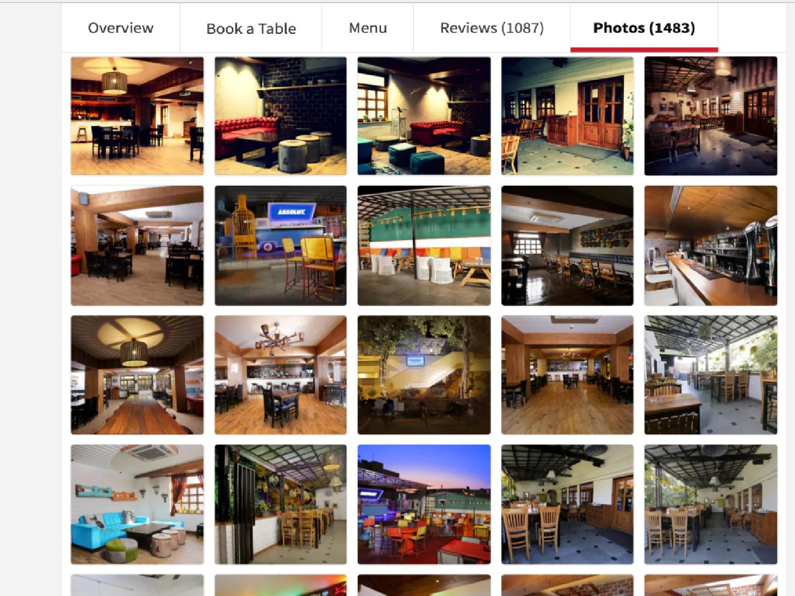  | 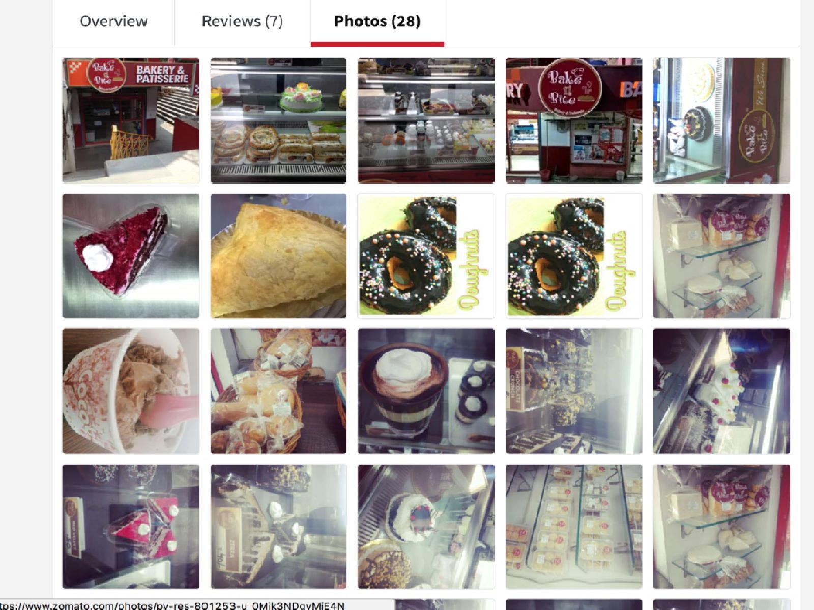

## **Can we model such Human Perception?**

## **Deep learning**

The topic needs no introduction. It’s a revolution especially in the image classification domain since the last 5 years. With “Alexnet” winning the Image-Net competition, improving error rate with a huge margin acted as a spark in the field. Since then, CNN has many state of the arts on its name.

**Network architecture of Alexnet.** 

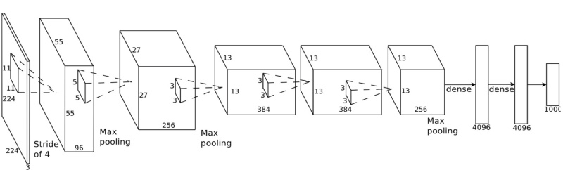

The first layer is input, where input is fed to the network. We can see their pooling operations, convolution operations finally followed by a fully connected layer 
and final softmax layer so that we get values as the probability for each class we label.

## **Fixed size input constraint**

  
  Input Layer   |  
  ------------- | -------------
  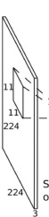 | Input image **re-sized to 224 * 224** irrespective of original image shape.

We always resize the input feature vector. If the image is larger, image is cropped 
or pad image if image dimensions are smaller, to get a fixed size input to feed the network

  

  The Mountains |  Qutub Minar
  ------------- | -------------
   | 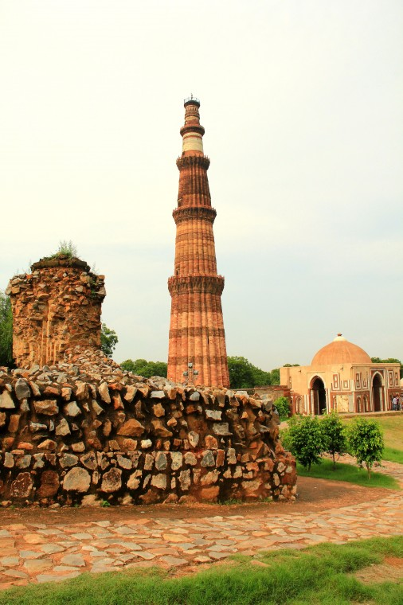

The above two images are **beautiful in their original aspect ratio.** 
What happens if we re-size the image to a fixed size of 224 * 224? 
Certainly, the image will **loose all it’s original aesthetic value!** 
From Landscape to Squared size. All damage is done. The original image composition is lost when an image is re-sized.

## **Demystifying the Network Architecture**

Let’s unveil the hidden layers! So, we can see that after the input, there are few layers of **Operations**. 
The operations are either **Max-pooling** or convolving with a filter i.e. **Convolution**.
So why the fixed size of input is required at all then?  
It’s because of the **Fully Connected Layer** just before the outputs. 
Fully Connected Layers are in the network for the non-linear combination of feature extracted before in convolution network.

Let's understand bit by bit.

## **Max Pooling**

Max pooling are there for **Down-sampling** the feature space while maintaining the spatial information
Max Pooling in action

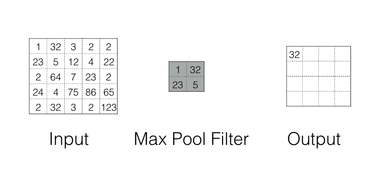

##**Spatial Pyramid Pooling**
In spp, an image is divided into bins. Each bin is pooled in its turn. As the number of bins is fixed, 
we always get the **Fixed Shape Output**.

Spp operation in action

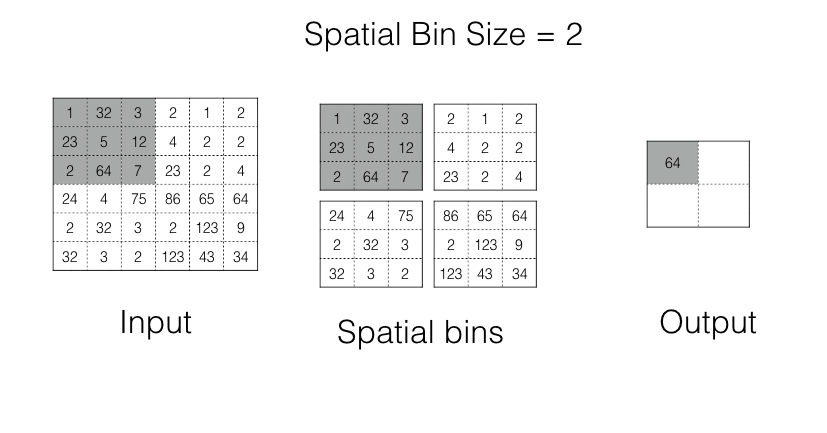

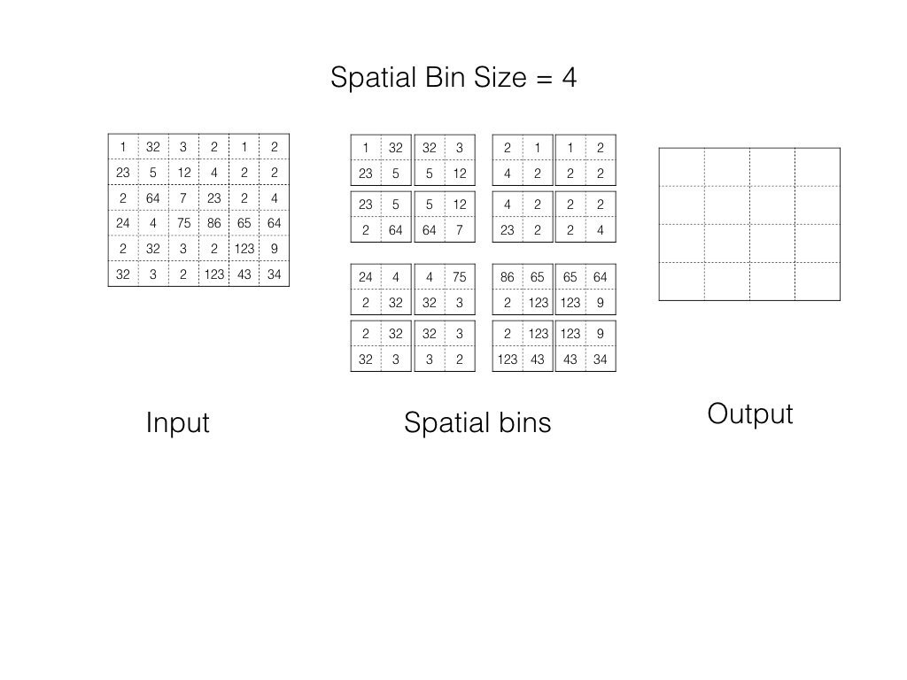

##**Spp Network Architecture**

The first network is the traditional CNN, we can see the **Max-pool layer** just before the fully connected layer.
In the second architecture, the last max pooling layer is **replaced by a Spp layer**. 
With the **Fixed Bin size (1,2,4)** we make sure that the fully connected layer gets the fixed shape input.

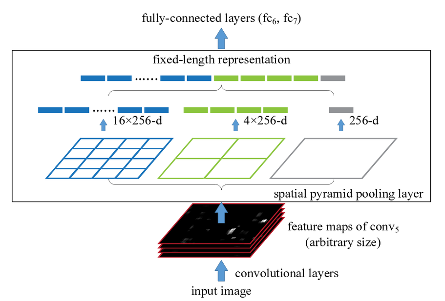

##**Training the Spp-Net**

Training the Spp-Net on **live-dataset**, very small dataset, about 1K images total, model achieved the accuracy of 75% on training data, 83% of the test data.

  Accuracy  |  Training Loss
  ------------- | -------------
  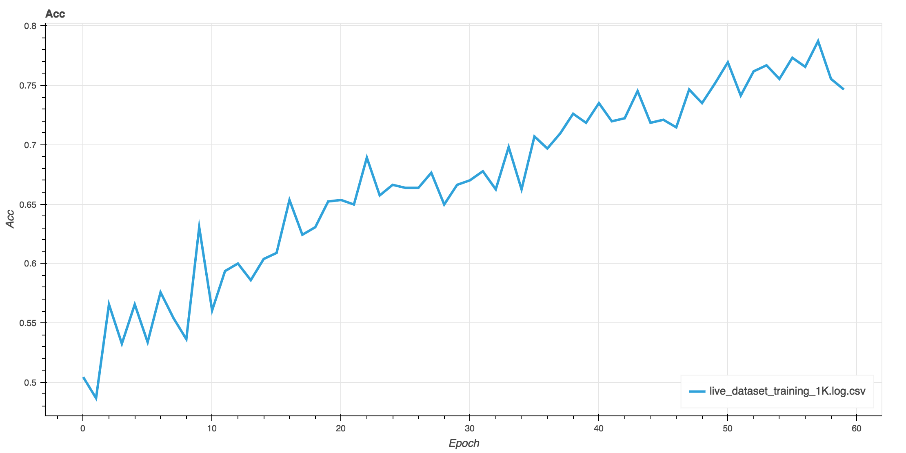  | 

##**Takeaways**

**With Spp in Network**  

* Model learns the scale invariant feature like SIFT(traditional image processing algorithm).
* One of the challenges in text classification with Deep learning is the fixed size feature vector representation of the sentence.

##**Interesting Results**

After training model, I experimented with few results. These are the most interesting and promising results I found.

  Blurred Cropped Image  | Complete Image
  ---------------------- | -------------
  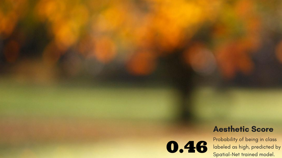 | 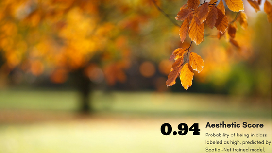

I recently came across a [Photographer](https://philliphaumesserphotography.com) experience from being an amateur to professional.  
He proved what difference a change in perspective can make. So, I decided to make my trained model judge for his efficacy.

  Amateur Click? Yes, it is.  | Pro Click? I am already amazed.
  ------------- | -------------
  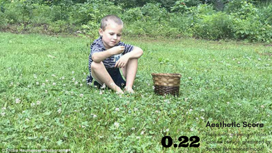  | 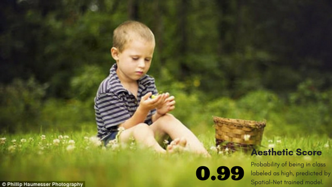

The aesthetic trained model has passed him with flying colors in Photographic skills. Well done Phillip Haumesser.

##**SPP Network**

##**References**

* [Kaiming He, Xiangyu Zhang, Shaoqing Ren, Jian Sun, Spatial Pyramid Pooling in Deep Convolutional Networks for Visual Recognition](https://arxiv.org/abs/1406.4729)
* [Alex Krizhevsky, Ilya Sutskever, Geoffrey E. Hinton, ImageNet Classification with Deep Convolutional Neural Networks 2012](https://papers.nips.cc/paper/4824-imagenet-classification-with-deep-convolutional-neural-networks.pdf)
* [Long Mai, Hailin Jin, Feing Liu, Composition-Preserving Deep Photo Aesthetics Assessment](https://ieeexplore.ieee.org/document/7780429/)

With that, I would like to wrap up. Any Questions?
