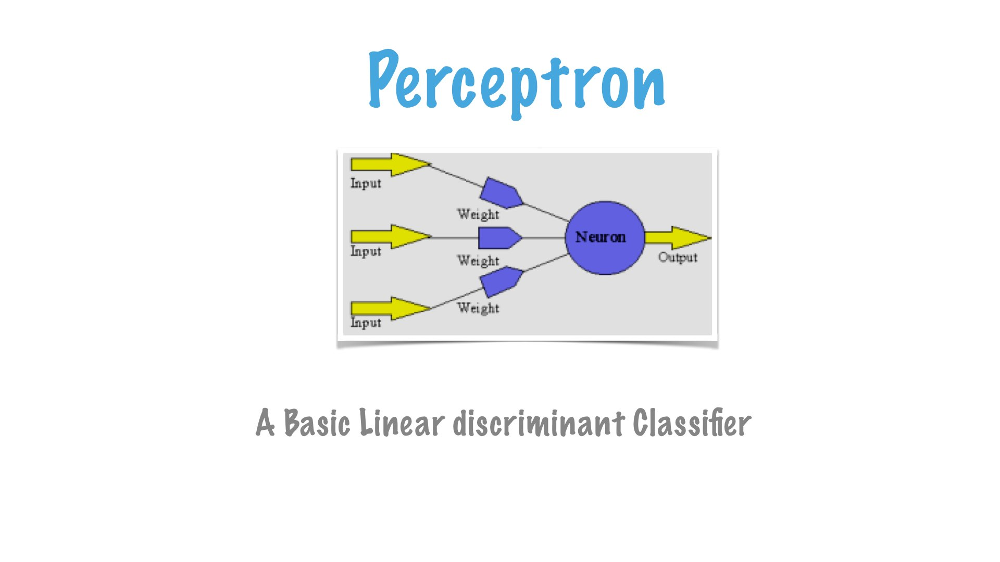

Title: Understanding CNN
Date: 2017-03-01 00:00
Category: Deep Learning

Let's start with the most basic element of Neural Network - **Perceptron**.

**Perceptron:** The elementary entity and basic form of neural network which can also learn. 
The development owes to a biological inspiration from a Neuron. Much like Neuron, a perceptron
 takes an input signal, process it, and stimulate a response. A single perceptron can learn to discriminate
  linear separable problem.
  Let's start with training a sample truth-table.
  

