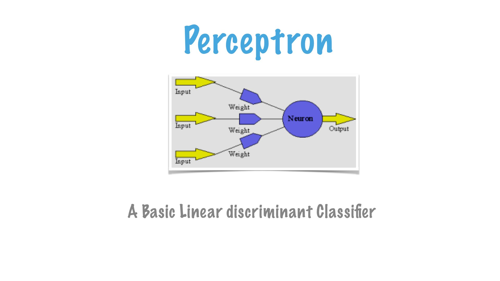
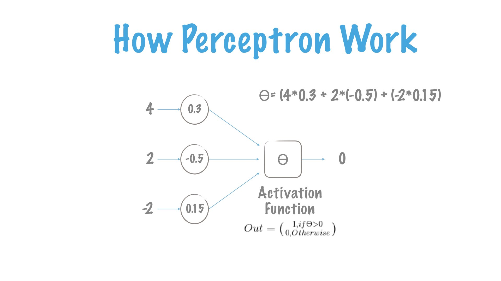
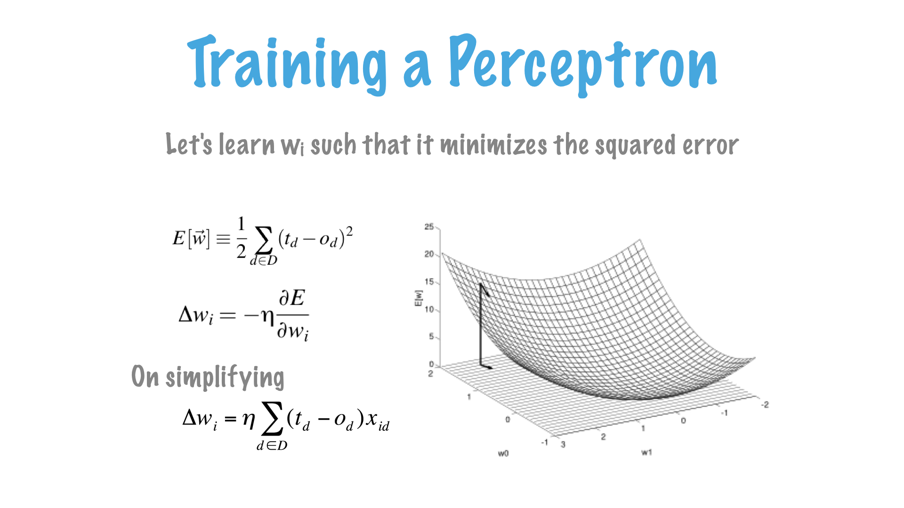
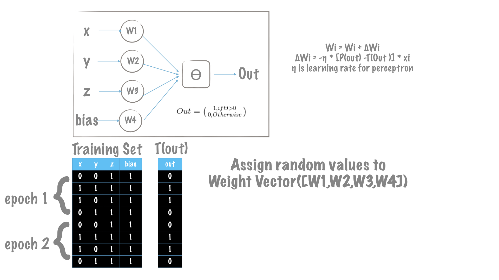
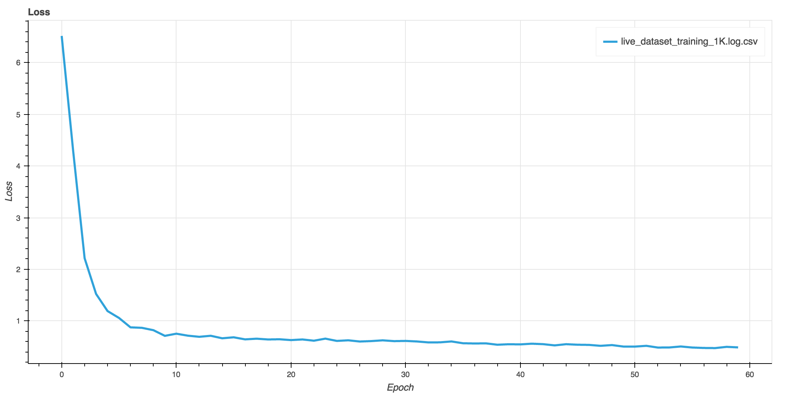

Title: Understanding CNN
Date: 2017-03-01 00:00
Category: Deep Learning

 

Let's start with the most basic element of Neural Network - **Perceptron**.

##**Perceptron** 
The elementary entity and basic form of neural network which can also learn. 
The development owes to a biological inspiration from a Neuron. Much like Neuron, a perceptron 
takes an input signal, process it, and stimulate a response. A single perceptron can learn to discriminate linear separable problem.
  

##**Representing a Perceptron** 
The more practical representation of Perceptron and its function.

##**Feature Vector**

Machine learning tasks are usually described in terms of how the machine
learning system should process an example. An example is a collection of features
that have been quantitatively measured from some object or event that we want
the machine learning system to process. We typically represent an example as a
vector x ∈ Rn where each entry xi of the vector is another feature. For example,
the features of an image are usually the values of the pixels in the image.

##**Classification** 
In this type of task, the computer program is asked to specify
which of k categories some input belongs to. To solve this task, the learning
algorithm is usually asked to produce a function f : Rn → {1, . . . , k}. When
y = f (x), the model assigns an input described by vector x to a category
identified by numeric code y. There are other variants of the classification
task, for example, where f outputs a probability distribution over classes.
An example of a classification task is object recognition, where the input
is an image (usually described as a set of pixel brightness values), and the
output is a numeric code identifying the object in the image. For example,
the Willow Garage PR2 robot is able to act as a waiter that can recognize
different kinds of drinks and deliver them to people on command (Goodfellow
et al., 2010). Modern object recognition is best accomplished with
deep learning (Krizhevsky et al., 2012; Ioffe and Szegedy, 2015). Object
recognition is the same basic technology that allows computers to recognize
faces (Taigman et al., 2014), which can be used to automatically tag people
in photo collections and allow computers to interact more naturally with
their users.

In this presentation, we are going to understand how perceptron learns actually.
To ease the purpose of understanding, we are going to learn this naive pattern.

##**Training Algorithm**
A machine learning algorithm is an algorithm that is able to learn from data. But
what do we mean by learning? Mitchell (1997) provides the definition “A computer
program is said to learn from experience E with respect to some class of tasks T
and performance measure P , if its performance at tasks in T , as measured by P ,
improves with experience E.” One can imagine a very wide variety of experiences
E, tasks T , and performance measures P , and we do not make any attempt in this
book to provide a formal definition of what may be used for each of these entities.
Instead, the following sections provide intuitive descriptions and examples of the
different kinds of tasks, performance measures and experiences that can be used
to construct machine learning algorithms.

##**Training Perceptron**

Taking aforementioned mathematical genius to our purview. 

### Epoch
An epoch is defined as a single pass through your entire training set while training a machine 
learning model. In a single epoch, all training samples are presented to your model 
once. So the total number of epochs in training a model gives the 
number of cycles through the entire training datasest.

##**Training Perceptron**

As explained in the Training Algorithm section, we aim to increase the performance at tasks in T.
In each epoch, we make a feed-forward our perceptron to predict the desired output. When the
predicted(calculated) is not consistent with the desired, we make an update to the weights of perceptron.
 Updating the weights means, wither the values of W are going to be increased or decreaded.
 This delta change is what **_Training Algorithm_** dictates in order to minimize the overall error/loss as defined.

While we train any model, we always have a loss defined over which the weights are optimized.
A very typical training loss should appear like this.

That's all for the theory, we will move to code in next session, Part-2 of [Understanding CNN - Part 2]().
