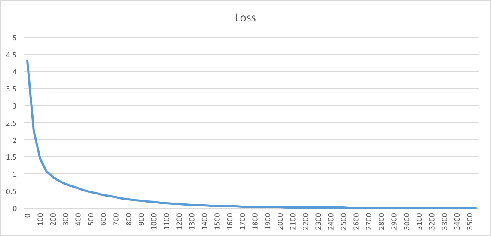
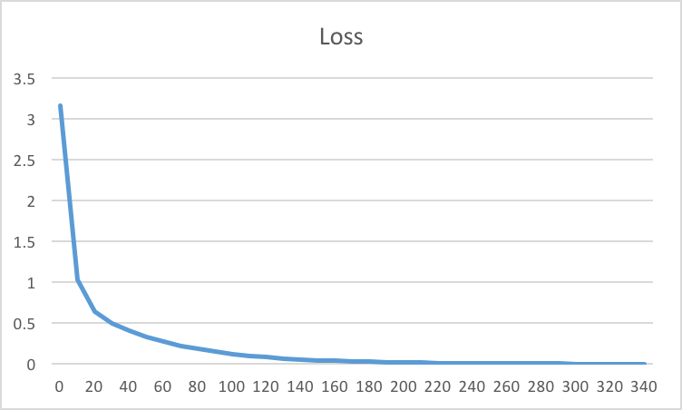

Title: Understanding CNN (Part 2)
Date: 2017-06-01 00:00
Category: Deep Learning

 

This is the continuation of Part-1 of this series. if you are just started in the subject please review
the [Part-1](http://amitkushwaha.co.in/understanding-cnn.html) of this series.


##**Training Perceptron**


### Dataset
```python
    X = np.array([[0, 0, 1], [1, 1, 1], [1, 0, 1], [0, 1, 1]])
    Y = np.array([0, 1, 1, 0])

```
We are starting with this truth-table to train our perceptron model.

**X**: Feature Vector of each sample

**Y**: Label for each sample


We initialize our perceptron model with random values of weights.

```python

W = np.random.rand(1, X.shape[1] + 1)

```

As explained in the Training Algorithm section, we aim to increase the performance at tasks in T.
In each epoch, we make a feed-forward our perceptron to predict the desired output. When the
predicted(calculated) is not consistent with the desired, we make an update to the weights of perceptron.
 Updating the weights means, wither the values of W are going to be increased or decreaded.
 This delta change is what **_Training Algorithm_** dictates in order to minimize the overall error/loss as defined.

While we train any model, we always have a loss defined over which the weights are optimized.
A very typical training loss should appear like this.

Learning rate is the momentum we give to our training speed.
```python
    eta = 0.001

```

In our case we have defined our loss as the squared error. As explained in the previous 
session, the delta weights update formulates to this:
```python

def delta_weight(eta, true_label, predicted_label, x):
    """

    :param eta: Learning rate
    :param true_label:
    :param predicted_label:
    :param x:
    """
    lambda_param = -1
    delta_w = lambda_param * eta * (predicted_label - true_label) * x
    return delta_w


```


<script src="https://gist.github.com/yardstick17/dcf240784bcdf455a534b6d4179cd9c1.js"></script>

So, we have hyper-parameter to choose when we start training a model. In our case, hyper-parameters are:

```python

"""
eta: learning rate of the training
lambda_param: to limit the maximum delta change in weights
"""
```


With different learning rates we may get different loss-plots. If the learning rate is high, weights updates are
large, which _**may**_ result in faster training.

With Learning Rate,**eta = 0.0001**, the training took more epochs to reach the desired minimum loss.



When Learning Rate,**eta = 0.01**, training speeds up almost with the factor of 10.



